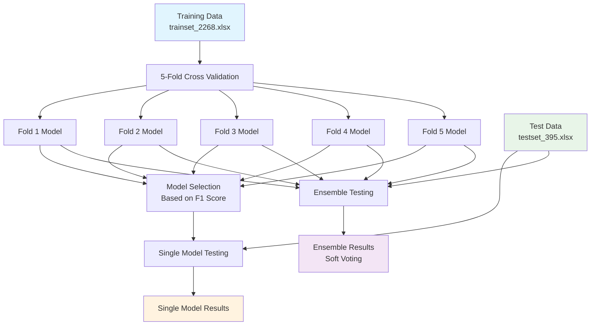

# BioBERT Model Training and Ensemble Testing

## Overview
This project implements a BioBERT text classification system for biomedical literature classification (T0 vs T2/4). The system uses 5-fold cross-validation with layer freezing strategy for robust training and ensemble voting for final predictions.

## Best Model Configuration
Based on extensive experiments, the optimal configuration achieved **F1 Score: 0.8671** with:
- **Model**: BioBERT-Base (`dmis-lab/biobert-base-cased-v1.1`)
- **Strategy**: Freeze first 8 layers, train last 4 layers + classifier
- **Best Individual Model**: Fold 4 (F1: 0.8340)

## Quick Start

### 1. Training Models (5-Fold Cross Validation)
```bash
python train_biobert_base.py
```

### 2. Testing Single Best Model
```bash
python test_simple.py
```

### 3. Testing Ensemble (All 5 Models)
```bash
python test_ensemble.py
```

## System Architecture



## Training Pipeline


## Model Configuration

### Core Parameters
| Parameter | Value |
|-----------|-------|
| **Model** | `dmis-lab/biobert-base-cased-v1.1` |
| **Task** | Binary Classification |
| **Max Length** | 512 tokens |
| **Dropout** | 0.3 |
| **Hidden Size** | 768 |
| **Layers** | 12 total |

### Optimal Training Hyperparameters (Freeze 8 Layers)
| Parameter | Value |
|-----------|-------|
| **Learning Rate** | `3e-5` |
| **Epochs** | `15` |
| **Batch Size** | `32` |
| **Gradient Accumulation** | `4` |
| **Weight Decay** | `0.01` |
| **Warmup Ratio** | `0.1` |
| **Frozen Layers** | `8` |

### Optimization Settings
| Setting | Value |
|---------|-------|
| **Optimizer** | AdamW |
| **Scheduler** | Linear with warmup |
| **FP16** | Enabled |
| **Class Weights** | Balanced |
| **Best Model Metric** | `eval_f1` |

## Complete Experimental Results

### Comprehensive Model Comparison

| Base Model | Frozen Layers/Full Layers | 5-fold Cross Validation Average F1 Score | Test Set F1 Score (Best Individual) | Test Set F1 Score (Ensemble - Soft Voting) |
|------------|---------------------------|-------------------------------------------|-------------------------------------|---------------------------------------------|
| **BioBERT-base** | **8/12** | **0.8671** | **0.8340** | **0.8261** |
| BioBERT-base | 0/12 | 0.8647 | 0.8235 | 0.8053 |
| BioBERT-large | 20/24 | 0.8496 | 0.8224 | 0.8081 |
| BioBERT-large | 12/24 | 0.8652 | 0.8330 | **0.8319** |
| BioBERT-large | 0/24 | 0.8489 | 0.8176 | 0.8043 |

### Key Findings
- **Best Configuration**: BioBERT-Base with 8/12 layers frozen (F1: 0.8671)
- **Layer Freezing**: Moderate freezing outperforms full fine-tuning
- **Model Efficiency**: Base model achieves comparable performance to Large model with 2-3x faster training
- **Best Ensemble**: BioBERT-Large 12/24 frozen layers (F1: 0.8319)


