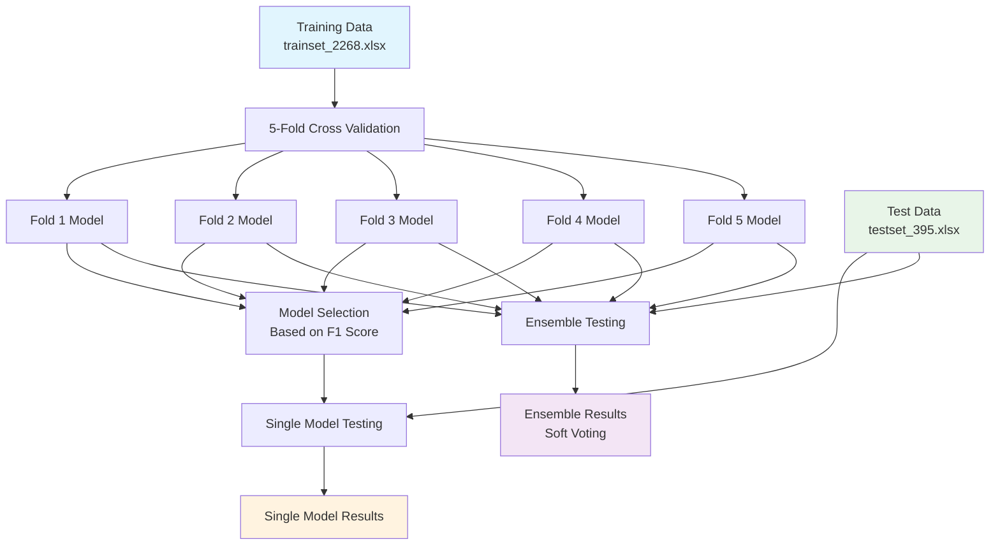

# BioBERT Large Model Training and Ensemble Testing

## Overview
This project implements a BioBERT based text classification system for biomedical literature classification (T0 vs T2/4). The system uses 5-fold cross-validation for robust training and ensemble voting for final predictions.

## Quick Start

### 1. Training Models (5-Fold Cross Validation)
```bash
python train_biobert_large.py
```

### 2. Testing Single Best Model
```bash
python test_simple.py
```

### 3. Testing Ensemble (All 5 Models)
```bash
python test_ensemble.py
```

## System Architecture



## Training Pipeline


## Model Configuration

### Core Parameters
| Parameter | Value | Description |
|-----------|-------|-------------|
| **Model** | `dmis-lab/biobert-large-cased-v1.1` | Pre-trained BioBERT Large model |
| **Task** | Binary Classification | T0 vs T2/4 classification |
| **Max Length** | 512 tokens | Maximum sequence length |
| **Dropout** | 0.5 | Classifier dropout rate |

### Training Hyperparameters
| Parameter | Value | Rationale |
|-----------|-------|-----------|
| **Learning Rate** | `1e-5` | Low rate for full fine-tuning |
| **Epochs** | `5` | Prevent overfitting |
| **Batch Size** | `16` | Memory efficiency |
| **Gradient Accumulation** | `2` | Effective batch size = 32 |
| **Weight Decay** | `0.1` | Strong regularization |
| **Warmup Ratio** | `0.2` | Gradual learning rate increase |
| **Frozen Layers** | `0` | Full model fine-tuning |

### Optimization Settings
| Setting | Value | Purpose |
|---------|-------|---------|
| **Optimizer** | AdamW | Default transformer optimizer |
| **Scheduler** | Linear with warmup | Stable convergence |
| **FP16** | Enabled | Memory and speed optimization |
| **Class Weights** | Balanced | Handle class imbalance |
| **Best Model Metric** | `eval_f1` | F1-score based selection |

## Data Configuration

### Dataset Statistics
```
Training Set: 2,268 articles
Test Set: 395 articles
Classes: T0 (majority), T2/4 (minority)
Class Distribution: Imbalanced (~60:40)
```

### Cross-Validation Setup
```
Strategy: 5-Fold Cross Validation
Random State: 50 (reproducible splits)
Validation Size per Fold: ~450 articles
Training Size per Fold: ~1,800 articles
```

## Ensemble Method

### Soft Voting Algorithm
```python
# For each test sample i:
probabilities_i = [model_1_prob_i, model_2_prob_i, ..., model_5_prob_i]
average_prob_i = mean(probabilities_i)
prediction_i = 1 if average_prob_i > 0.5 else 0
```

### Model Selection Criteria
- Individual models selected based on highest F1 score
- All 5 fold models used in ensemble regardless of individual performance
- Soft voting chosen over hard voting for better probability utilization

